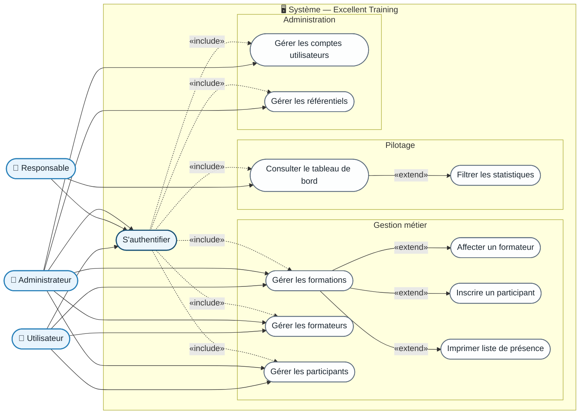

# Diagramme de Cas d'Utilisation Général — Excellent Training

## Description

Ce diagramme représente l'ensemble des fonctionnalités offertes par le système de gestion de
formation du centre **Excellent Training** (Green Building) et les acteurs qui peuvent les
déclencher.

### Acteurs

| Acteur | Rôle technique | Description |
|---|---|---|
| **Utilisateur** | `ROLE_UTILISATEUR` | Opérations métier : formations, formateurs, participants |
| **Responsable** | `ROLE_RESPONSABLE` | Consultation en lecture seule du tableau de bord |
| **Administrateur** | `ROLE_ADMIN` | Accès cumulatif : toutes les actions + gestion des comptes et référentiels |

### Points clés

- Le cas **S'authentifier** est un prérequis de toutes les autres actions (`<<include>>`).
- L'**Administrateur** hérite de tous les droits de l'**Utilisateur** ; ses cas spécifiques
  sont la **Gestion des comptes** et la **Gestion des référentiels**.
- Le **Responsable** accède uniquement au tableau de bord en **lecture seule** ; les boutons
  de modification sont désactivés côté React selon le rôle porté dans le JWT.
- **Imprimer la liste de présence** est une extension du cas *Consulter une formation*
  (`<<extend>>`).
- **Inscrire un participant** est une extension du cas *Gérer les formations*
  (`<<extend>>`).

## Cas d'utilisation détaillés

| ID | Cas d'utilisation | Acteurs | Type |
|---|---|---|---|
| UC-00 | **S'authentifier** | Tous | Primaire |
| UC-01 | **Gérer les formations** (CRUD, consultation) | Utilisateur, Admin | Primaire |
| UC-02 | **Affecter un formateur** à une formation | Utilisateur, Admin | Extension de UC-01 |
| UC-03 | **Inscrire un participant** à une formation | Utilisateur, Admin | Extension de UC-01 |
| UC-04 | **Imprimer la liste de présence** | Utilisateur, Admin | Extension de UC-01 |
| UC-05 | **Gérer les formateurs** (CRUD) | Utilisateur, Admin | Primaire |
| UC-06 | **Gérer les participants** (CRUD) | Utilisateur, Admin | Primaire |
| UC-07 | **Consulter le tableau de bord** statistique | Responsable, Admin | Primaire |
| UC-08 | **Filtrer les statistiques** (par année / domaine) | Responsable, Admin | Extension de UC-07 |
| UC-09 | **Gérer les comptes utilisateurs** (CRUD) | Admin | Primaire |
| UC-10 | **Gérer les référentiels** (domaines, structures, profils, employeurs) | Admin | Primaire |
