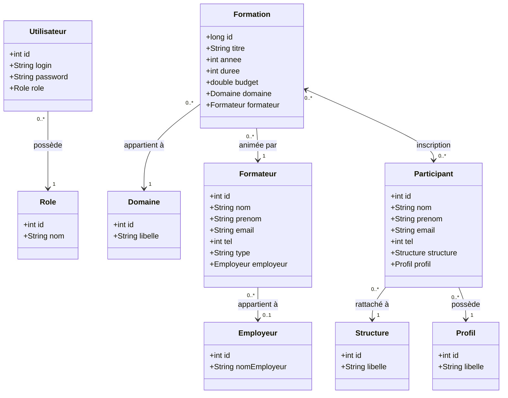

# Diagramme de Classes — Excellent Training

## Description

Ce diagramme représente l'ensemble des entités du système de gestion de formation du centre Excellent Training (Green Building) et leurs relations.

### Entités principales
- **Formation** : session de formation avec titre, année, durée et budget
- **Participant** : employé inscrit à une ou plusieurs formations
- **Formateur** : animateur de formation (interne ou externe)

### Référentiels
- **Domaine** : catégorie de la formation (Informatique, Finance, etc.)
- **Structure** : direction du participant (Centrale ou Régionale)
- **Profil** : poste du participant (Cadre, Technicien, etc.)
- **Role** : droit d'accès de l'utilisateur (Admin, Responsable, Utilisateur)
- **Employeur** : société du formateur externe

### Relations clés
- `Formation ↔ Participant` : Many-to-Many via table de jointure `inscription`
- `Formation → Formateur` : Many-to-One
- `Formation → Domaine` : Many-to-One
- `Formateur → Employeur` : Many-to-One (optionnel, uniquement pour les formateurs externes)

