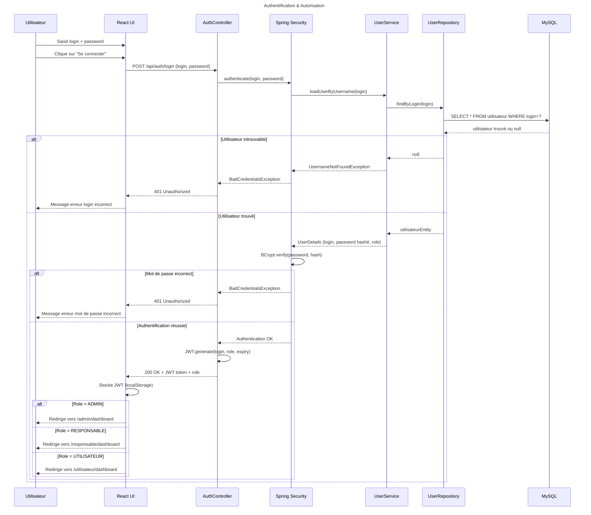

# Séquence 1 — Authentification & Autorisation

## Description

Ce diagramme décrit le processus de connexion d'un utilisateur au système.

### Acteurs
- **Utilisateur** : tout employé du centre disposant d'un compte
- **React UI** : interface web frontend
- **AuthController** : point d'entrée REST de l'authentification
- **Spring Security** : couche de sécurité gérant l'authentification
- **UserService** : service métier chargeant les détails utilisateur
- **UserRepository** : accès base de données pour les utilisateurs
- **MySQL** : base de données relationnelle

### Points clés
- Le mot de passe est vérifié via **BCrypt** — jamais comparé en clair
- En cas de succès, un **token JWT** est généré et renvoyé au frontend
- Le frontend stocke le JWT et redirige selon le **rôle** de l'utilisateur
- Trois dashboards distincts : `/admin`, `/responsable`, `/utilisateur`

