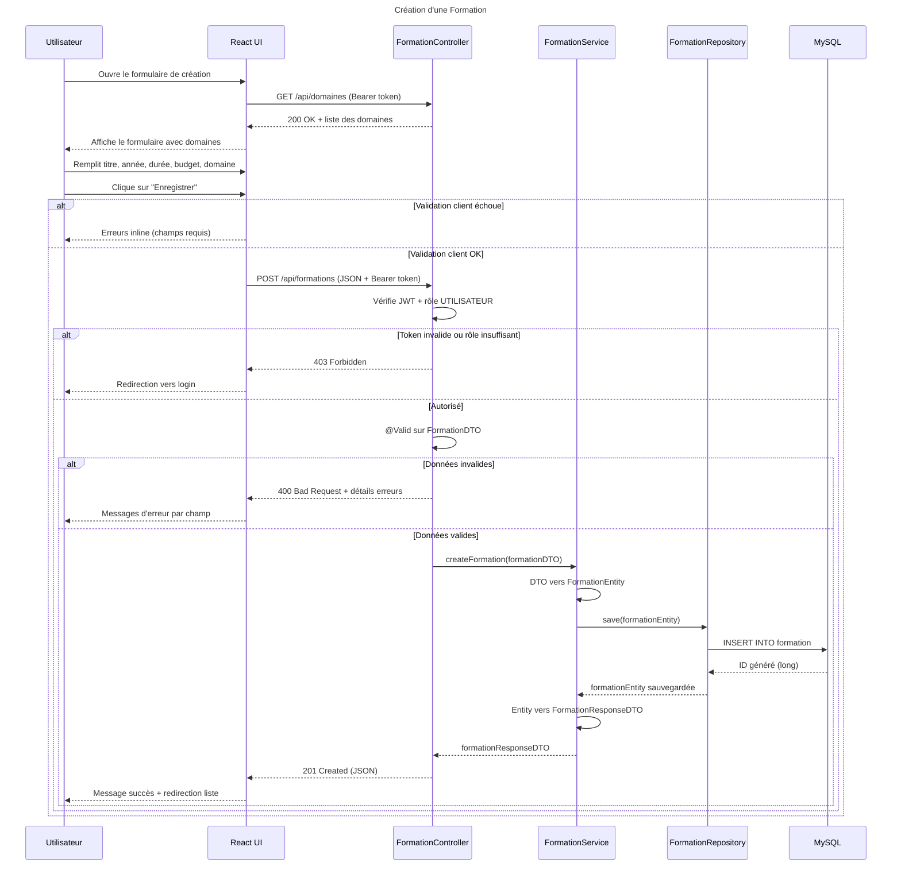

# Séquence 2 — Création d'une Formation

## Description

Ce diagramme décrit le processus de création d'une nouvelle session de formation par un Simple Utilisateur.

### Acteurs
- **Utilisateur** : employé du centre avec le rôle `UTILISATEUR`
- **React UI** : formulaire de création de formation
- **FormationController** : point d'entrée REST
- **FormationService** : logique métier et conversion DTO ↔ Entity
- **FormationRepository** : accès base de données
- **MySQL** : base de données relationnelle

### Points clés
- Le formulaire charge d'abord la liste des **domaines** disponibles depuis l'API
- La validation se fait en **deux étapes** : côté client (React) puis côté serveur (`@Valid`)
- Le **Bearer token JWT** est obligatoire — seul le rôle `UTILISATEUR` ou `ADMIN` est autorisé
- Le service effectue la conversion **DTO → Entity** avant la sauvegarde
- La réponse retourne un **DTO** (jamais l'entité directement)

