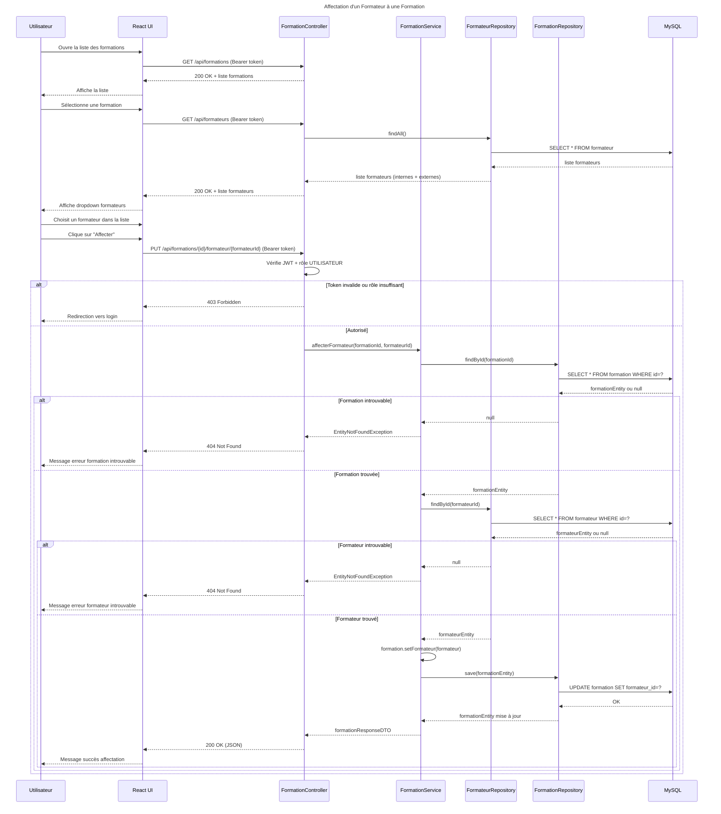

# Séquence 3 — Affectation d'un Formateur à une Formation

## Description

Ce diagramme décrit le processus d'affectation d'un formateur (interne ou externe) à une formation existante.

### Acteurs
- **Utilisateur** : employé du centre avec le rôle `UTILISATEUR`
- **React UI** : interface de sélection du formateur
- **FormationController** : point d'entrée REST
- **FormationService** : logique métier
- **FormateurRepository** : accès base de données formateurs
- **FormationRepository** : accès base de données formations
- **MySQL** : base de données relationnelle

### Points clés
- L'utilisateur sélectionne d'abord une **formation existante**
- La liste des formateurs affiche les **internes et externes** ensemble
- L'opération utilise `PUT` car c'est une **mise à jour** d'une ressource existante
- Deux vérifications `404` : formation introuvable ET formateur introuvable
- La relation `Formation → Formateur` est **Many-to-One** — un seul formateur par formation

