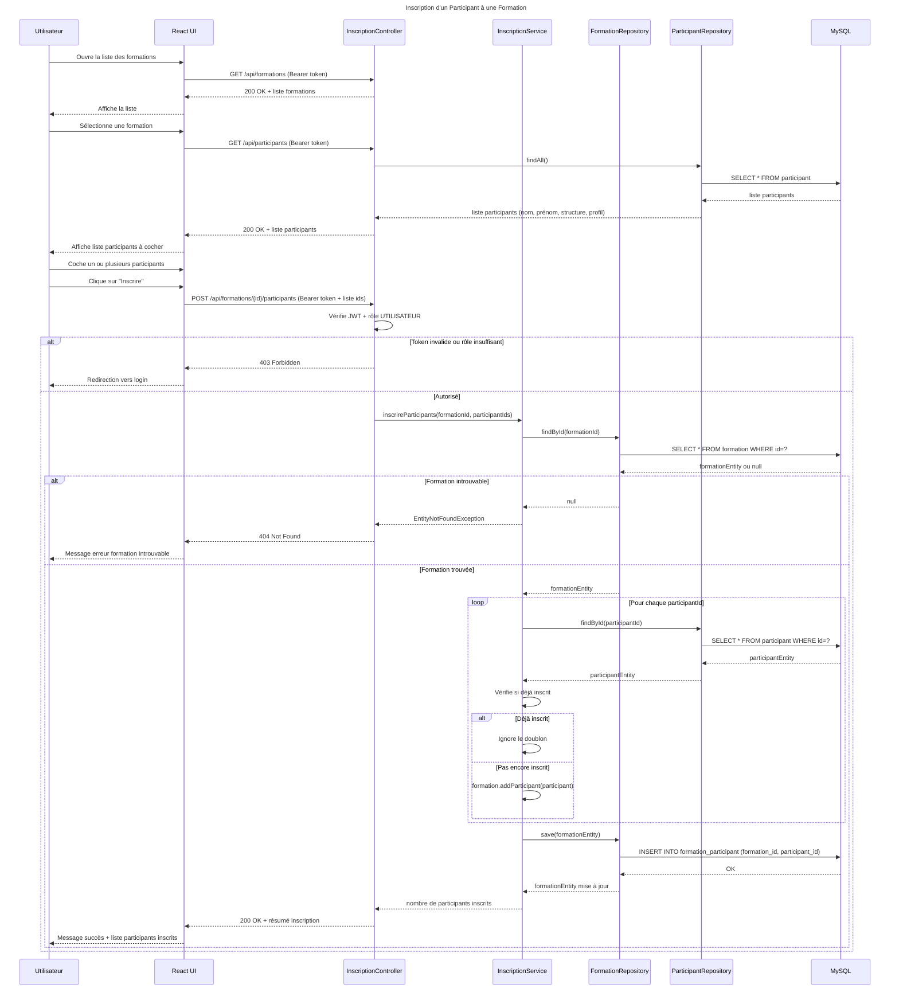

# Séquence 4 — Inscription d'un Participant à une Formation

## Description

Ce diagramme décrit le processus d'inscription d'un ou plusieurs participants à une formation existante.

### Acteurs
- **Utilisateur** : employé du centre avec le rôle `UTILISATEUR`
- **React UI** : interface de sélection des participants
- **InscriptionController** : point d'entrée REST
- **InscriptionService** : logique métier avec gestion des doublons
- **FormationRepository** : accès base de données formations
- **ParticipantRepository** : accès base de données participants
- **MySQL** : base de données relationnelle

### Points clés
- Relation **Many-to-Many** entre `Formation` et `Participant` via la table `formation_participant`
- L'utilisateur peut inscrire **plusieurs participants** en une seule opération
- Le service vérifie les **doublons** — un participant déjà inscrit est ignoré silencieusement
- Le `loop` montre le traitement itératif de chaque participant sélectionné
- Un seul `save()` final déclenche tous les `INSERT` dans la table de jointure

