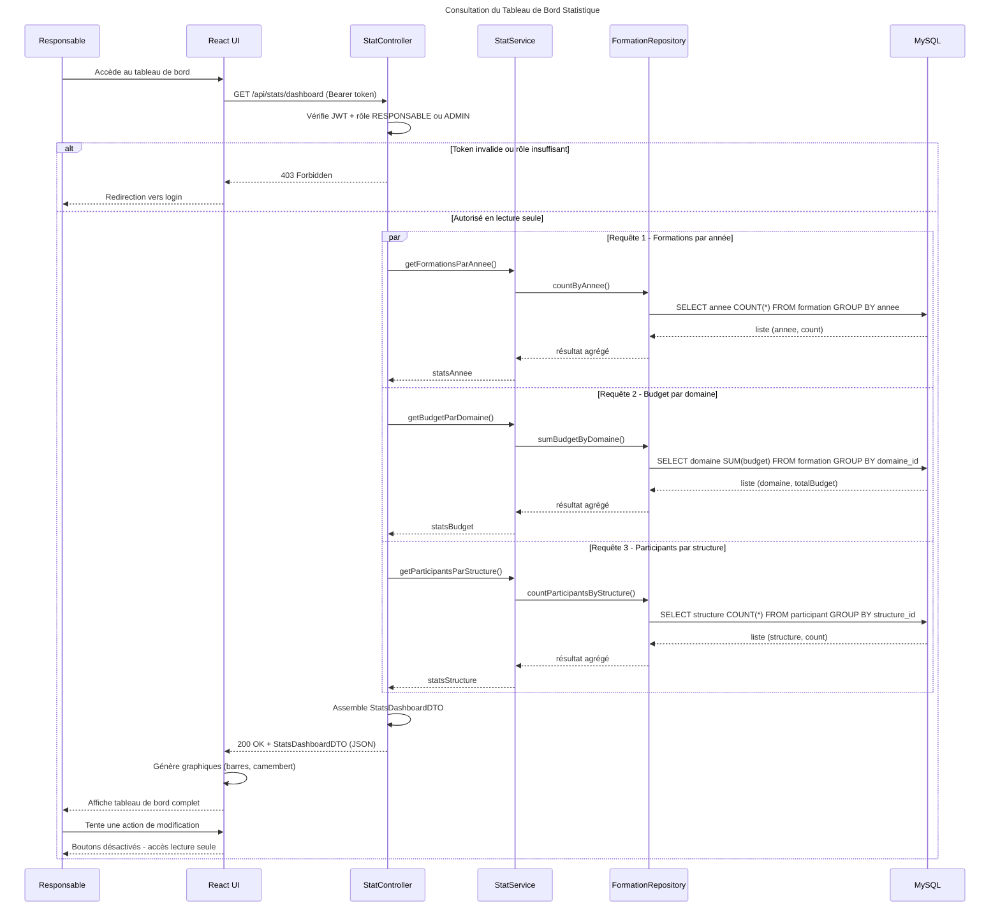

# Séquence 5 — Consultation du Tableau de Bord Statistique

## Description

Ce diagramme décrit la consultation des statistiques par le Responsable du centre. C'est un accès en **lecture seule**.

### Acteurs
- **Responsable** : responsable du centre avec le rôle `RESPONSABLE`
- **React UI** : tableau de bord avec graphiques
- **StatController** : point d'entrée REST des statistiques
- **StatService** : logique de calcul des agrégations
- **FormationRepository** : requêtes JPQL agrégées
- **MySQL** : base de données relationnelle

### Points clés
- Accès **lecture seule** — le Responsable ne peut pas modifier les données
- Les 3 requêtes statistiques sont exécutées en **parallèle** (`par/and`) pour de meilleures performances
- Les agrégations sont calculées côté **backend** via des requêtes JPQL (`GROUP BY`, `SUM`, `COUNT`)
- Le frontend génère les graphiques à partir du JSON reçu
- Les boutons de modification sont **désactivés** côté React selon le rôle dans le JWT

