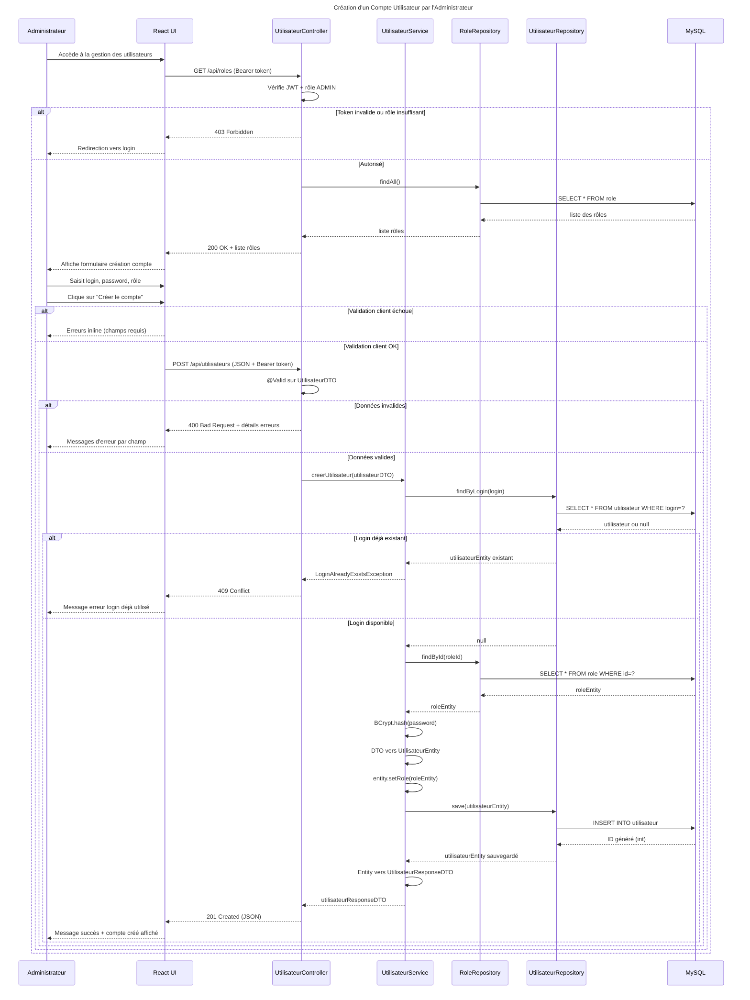

# Séquence 6 — Création d'un Compte Utilisateur

## Description

Ce diagramme décrit la création d'un compte utilisateur pour un employé du centre par l'Administrateur. Il n'existe pas d'inscription publique dans ce système.

### Acteurs
- **Administrateur** : utilisateur avec le rôle `ADMIN`
- **React UI** : formulaire de création de compte
- **UtilisateurController** : point d'entrée REST
- **UtilisateurService** : logique métier avec hashage du mot de passe
- **RoleRepository** : accès base de données des rôles
- **UtilisateurRepository** : accès base de données des utilisateurs
- **MySQL** : base de données relationnelle

### Points clés
- Seul l'**Administrateur** peut créer des comptes — pas d'inscription publique
- Le login est vérifié pour éviter les **doublons** — `409 Conflict` si déjà existant
- Le mot de passe est **hashé via BCrypt** avant la sauvegarde — jamais stocké en clair
- Le rôle est chargé depuis la base et attaché à l'entité avant le `save()`
- La réponse ne contient jamais le mot de passe — uniquement un `UtilisateurResponseDTO`

