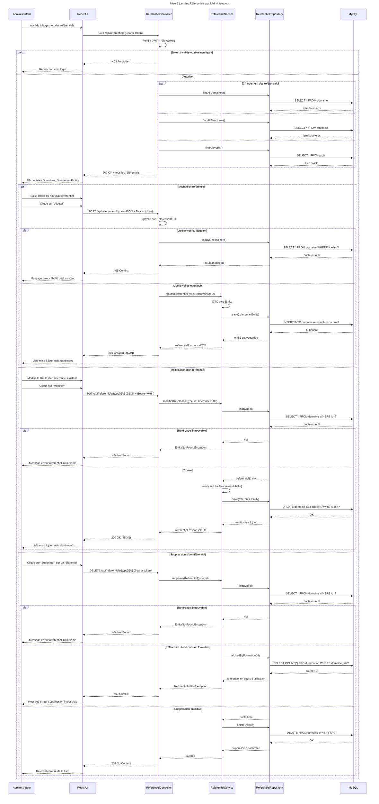

# Séquence 7 — Mise à jour des Référentiels

## Description

Ce diagramme décrit la gestion des référentiels (Domaine, Structure, Profil) par l'Administrateur. Il couvre les 3 opérations CRUD : ajout, modification et suppression.

### Acteurs
- **Administrateur** : utilisateur avec le rôle `ADMIN`
- **React UI** : interface de gestion des référentiels
- **ReferentielController** : point d'entrée REST
- **ReferentielService** : logique métier
- **ReferentielRepository** : accès base de données
- **MySQL** : base de données relationnelle

### Points clés
- Les 3 référentiels (Domaine, Structure, Profil) sont chargés en **parallèle** au démarrage
- L'ajout vérifie les **doublons de libellé** — `409 Conflict` si déjà existant
- La suppression vérifie si le référentiel est **utilisé par une formation** avant de supprimer — protège l'intégrité des données
- La suppression réussie retourne `204 No Content` — pas de body dans la réponse
- Toute modification est **instantanément visible** pour les autres utilisateurs du système

